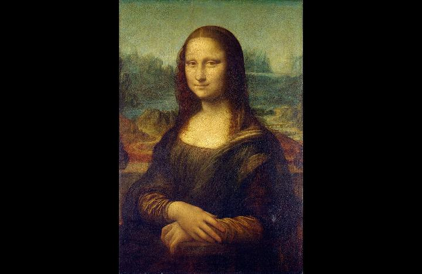
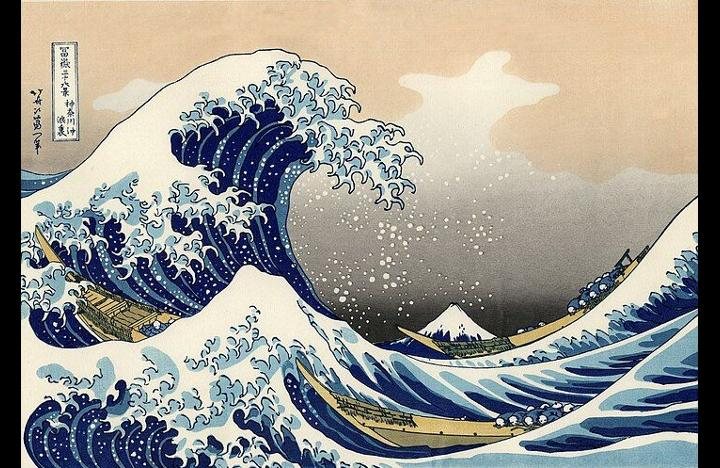
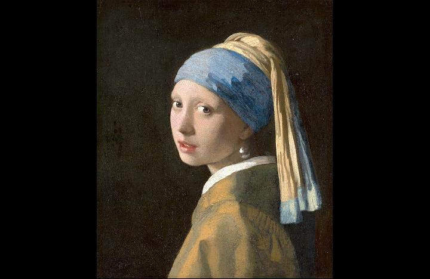
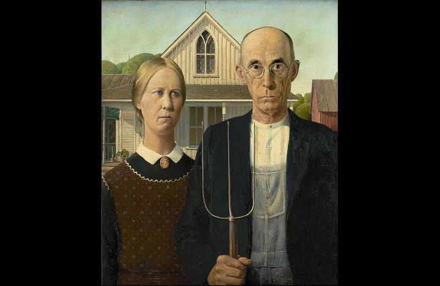

# ArtEvolver

[](https://openjdk.org/)
[](https://maven.apache.org/)
[](https://www.gnu.org/licenses/gpl-3.0)
[](https://twitter.com/ArtEvolver)

**ArtEvolver** turns any image into evolving mosaic art. Drop a photo, watch it transform, or play the browser clicker to evolve it one swap at a time.


---

## Welcome

If you are new: run the clicker. It opens in your browser and explains itself.  
If you are technical: the full desktop app is here too.

**You can:**
- Evolve triangle mosaics in real time
- Play the clicker with upgrades, ascensions, and achievements
- Explore retro console palettes and pixel modes

---

## Quick Start (No Setup Headaches)

**Windows:**
```
clicker.bat
```

**Mac/Linux:**
```
chmod +x clicker.sh
./clicker.sh
```

This builds the project and opens the clicker in your browser.

---

## Sample Images (From This Repo)

These are public-domain sources bundled with the project. They are the same images you can pick in the clicker.







---

## How It Works (One Minute)

ArtEvolver uses a fixed grid (triangles or pixels). The grid never changes -- only the colors evolve.  
An engine tries thousands of swaps per second to move closer to the target image.

- Fitness ranges from 0.0 (no match) to 1.0 (perfect match)
- The best candidate is always shown in real time

---

## Ways to Play

### Evolution Clicker (Browser)
Drop an image and evolve it with clicks. Buy upgrades, unlock samples, ascend, and complete masterpieces.

### Full Desktop App (Swing GUI)
Tournament mode, benchmarks, and advanced controls.

**Windows:** `start.bat`  
**Mac/Linux:** `./start.sh`

---

## Retro Console Modes (Pixel Style)

Choose classic palettes and resolutions:
- Game Boy (DMG/Gray)
- Game Boy Color
- Game Boy Advance
- Sega Genesis
- SNES

Square pixels, limited palettes, and a strong retro look.

---

## Getting Started (Full Setup)

### Requirements
- Java 21+
- Maven 3.6+

### Install Java
**Windows:** `winget install EclipseAdoptium.Temurin.21.JDK`  
**Mac:** `brew install --cask temurin@21`  
**Linux:** `sudo apt install temurin-21-jdk`

### Install Maven
**Windows:** `winget install Apache.Maven`  
**Mac:** `brew install maven`  
**Linux:** `sudo apt install maven`

### Build
```
mvn compile
```

---

## Video Export (Timelapse)

Frames export as PNGs. Turn them into video:
```
ffmpeg -framerate 30 -i frame_%06d.png -c:v libx264 -pix_fmt yuv420p output.mp4
```

---

## Contributing

We welcome help with:
- New palettes and sample packs
- Performance improvements
- UI/UX polish
- Documentation

---

## License

GPL v3. See [LICENSE](LICENSE).

---

## Links

- GitHub: https://github.com/Geomancer86/ArtEvolver
- Twitter/X: https://twitter.com/ArtEvolver
